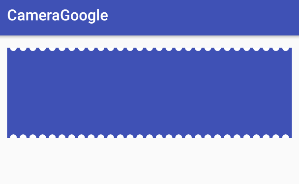

# 自定义 View

实现一个锯齿形状的 ViewGroup。

### 效果 :



### 大体思路：
不断的画圆就行了，注意控制间距和所需画圆的数量即可。 
由上图可知，圆的数量 circleNum 比间距 gap 少1，即 gap = circleNum + 1。
那么圆的数量如何确定呢? 
首先
$$
w = circleNum*(gap+radius*2) + gap
$$
其中 `w` 是整个 Layout 宽度，`circleNum` 是所需圆的数量，`gap` 是间距，`radius` 是圆半径。
因此，很容易算出 circleNum 的值，如下：

$$
circleNum = (w - gap) / (gap + radius * 2)
$$
有了圆的数量，半径，间距，剩下的就是坐标问题了，在哪个坐标画圆，具体可在代码中查看，很简单的一句代码。
另外 `remain` 所表达的是 circleNum 不是刚好整除的情况，这个时候会出现右边最后一个间距比其它的间距都要宽。所以在绘制第一个圆的时候加上remain 的一半，这样最后一个和第一个间距宽度就是一样的了。


### 代码：

```
package com.yjnull.cameragoogle.camera.chapter3;

import android.content.Context;
import android.graphics.Canvas;
import android.graphics.Color;
import android.graphics.Paint;
import android.support.annotation.Nullable;
import android.util.AttributeSet;
import android.widget.LinearLayout;

/**
 * Created by yangya on 2018/3/27.
 */

public class SawToothLayout extends LinearLayout{
    private Paint mPaint = new Paint(Paint.ANTI_ALIAS_FLAG);

    private int radius = 12; //圆的半径
    private int gap = 10;    //间距
    private int remain;      //所需圆的数量不是整除的余数
    private int circleNum;   //所需画圆的数量

    public SawToothLayout(Context context) {
        super(context);
        init();
    }

    public SawToothLayout(Context context, @Nullable AttributeSet attrs) {
        super(context, attrs);
        init();
    }

    public SawToothLayout(Context context, @Nullable AttributeSet attrs, int defStyleAttr) {
        super(context, attrs, defStyleAttr);
        init();
    }

    private void init() {
        mPaint.setColor(Color.WHITE);
        mPaint.setDither(true);
        mPaint.setStyle(Paint.Style.FILL);
    }

    @Override
    protected void onSizeChanged(int w, int h, int oldw, int oldh) {
        super.onSizeChanged(w, h, oldw, oldh);
        if (remain == 0) {
            remain = (w - gap) % (radius * 2 + gap);
        }
        circleNum = (w - gap) / (radius * 2 + gap);
    }

    @Override
    protected void onDraw(Canvas canvas) {
        super.onDraw(canvas);
        for (int i = 0; i < circleNum; i++) {
            float x = gap + radius + remain/2 + ((radius*2 + gap)*i);
            canvas.drawCircle(x, 0, radius, mPaint);
            canvas.drawCircle(x, getHeight(), radius, mPaint);
        }
    }
}

```


具体详细请查看原文地址：[http://www.cnblogs.com/yangqiangyu/p/5499945.html](http://www.cnblogs.com/yangqiangyu/p/5499945.html)

