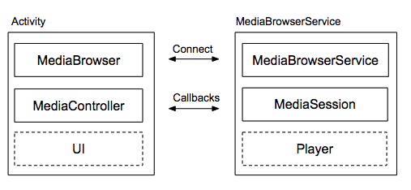

# Audio app overview

音频应用程序的首选体系结构是 client/server 设计。player 及其 media session 在 `MediaBrowserService` 内实现，UI 和 media controller 与 `MediaBrowser` 一起存在于 Activity 中。

`MediaBrowserService` 提供两个主要的功能：
- 当你使用`MediaBrowserService` 时，具有 `MediaBrowser` 的其他组件和应用程序可以发现你的服务，创建他们自己的 media controller，连接到你的 media session，并控制播放器。这就是 Wear OS 和 Android Auto Applications 如何访问你的媒体应用程序的方式。
- 它也提供可选的 `browsing API`。应用程序不是必须使用此功能。`browsing API` 允许客户端查询服务并构建其内容层次结构的表示，这可能代表播放列表，媒体库或其他类型的集合。

> **Note:** 与 `media session` 和 `media controller` 的情况一样， media browser services 和 media browsers 的推荐实现是 `MediaBrowserServiceCompat` 和 `MediaBrowserCompat` 类，它们在  [media-compat support library](https://developer.android.com/topic/libraries/support-library/features#v4-media-compat) 中定义。它们取代了 API 21 中引入的早期版本的 `MediaBrowserService` 和 `MediaBrowser` 。 为简洁起见，术语 `MediaBrowserService` 和 `MediaBrowser` 特指  `MediaBrowserServiceCompat` 和 `MediaBrowserCompat` 的实例。

#### [Building a media browser service](https://developer.android.com/guide/topics/media-apps/audio-app/building-a-mediabrowserservice)

　　如何创建一个包含 `media session` ，管理客户端连接，已经在播放音频时成为一个前台服务的 `media browser service`。

#### [Building a media browser client](https://developer.android.com/guide/topics/media-apps/audio-app/building-a-mediabrowser-client)

　　如何创建一个包含 UI 和 `media controller` 的 `media browser client` ，以及与 `media browser service` 进行连接和通信。

#### [Media session callbacks](https://developer.android.com/guide/topics/media-apps/audio-app/mediasession-callbacks)

　　描述 `media session callback` 方法如何管理 `media session`，`media browser service` 以及其他应用程序组件（如 notifications 和 broadcast receivers）。

#### [android-MediaBrowserSevice](https://github.com/googlesamples/android-MediaBrowserService/)

　　此 GitHub 示例演示了如何实现一个运行后台播放音频的 media app，并提供向其他应用程序公开的媒体库。