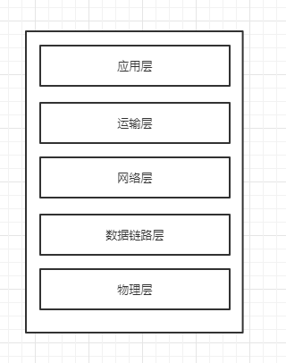
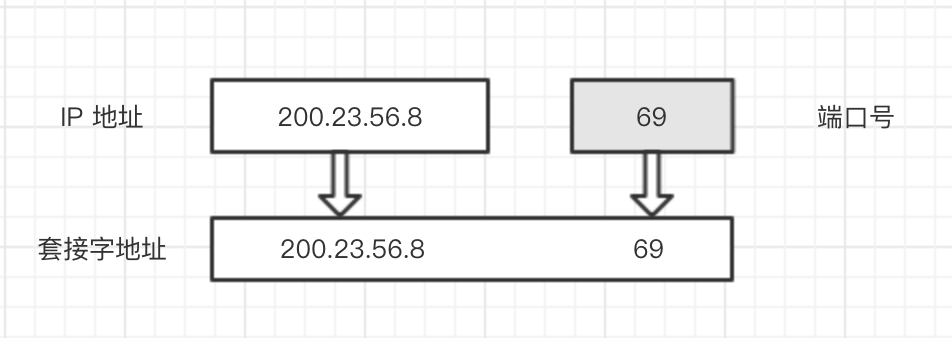
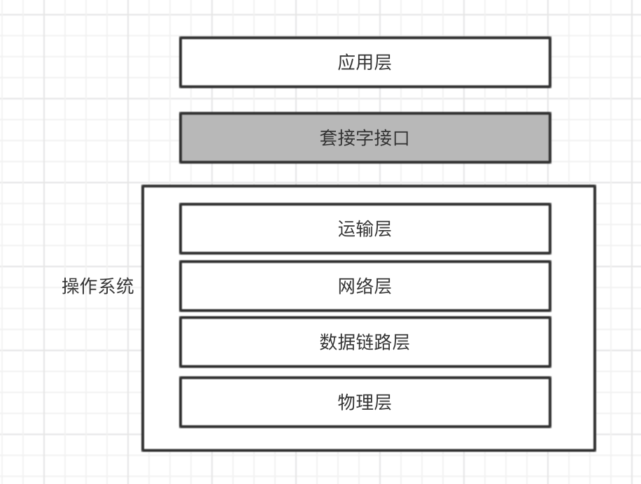
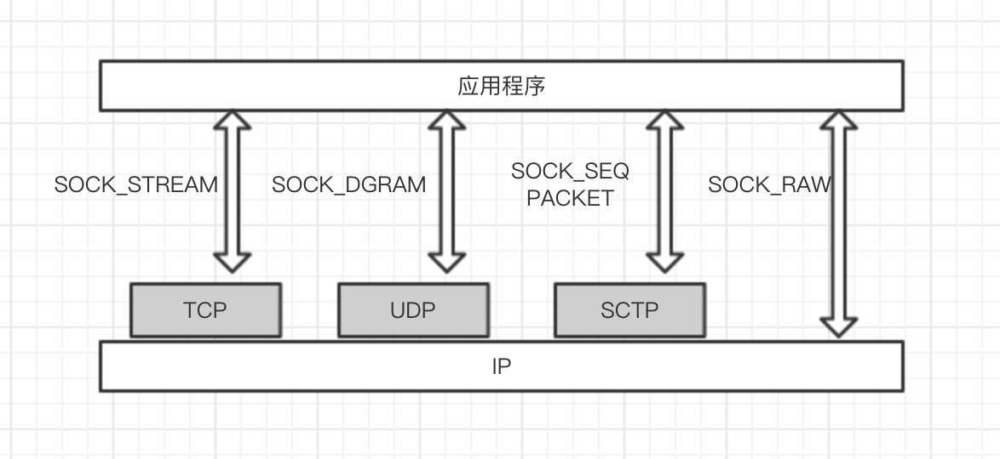
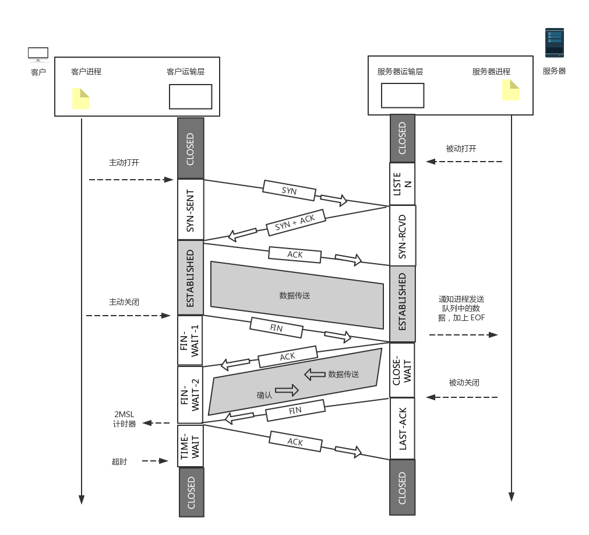

## Socket 理解

**参考：**
书籍《TCP / IP 协议族》
http://www.ruanyifeng.com/blog/2012/05/internet_protocol_suite_part_i.html

### 0. 前言

提起 Socket ，大家都说是什么 套接字、进程间通信、对 TCP / IP 协议进行封装的编程调用接口 balabala 的，说真的，刚接触的时候，真的是一脸懵逼，实在是不理解套接字到底是什么意思。然而最近的我貌似懂了点，也有可能是以前根本没认真看书吧。现在至少能理解它究竟是个什么东西了。

想要理解 Socket，我们得先弄懂一些网络的基础知识，要不然是无法理解的。比如两台电脑究竟是怎样通信的，希望你能先去看看 [阮一峰老师的 互联网协议入门](http://www.ruanyifeng.com/blog/2012/05/internet_protocol_suite_part_i.html)
我相信你看完后再理解 Socket 应该是不难的了。

### 1. 网络基础

#### 1.1 计算机网络分层
看了阮一峰老师的 互联网协议入门，我相信你已经知道计算机网络分为五层：物理层、数据链路层、网络层、运输船、应用层


其中：
- 物理层 ：把电脑连接起来的物理手段，用于传送 0 和 1 的电信号。
- 数据链路层 ：由于单纯的 0 和 1 电信号没有任何意义，因此出现了 **以太网协议**，它将这些电信号分组，一组电信号构成一个数据包，叫做 **帧**，并且我们还知道这一层会把 **MAC 地址** 包含在 帧 的标头（Head）。
- 网络层 ：在数据链路层，我们可以通过广播的方式发送数据，但是规定收发双方得在同一个 **子网络**，那不同子网络的两台计算机是无法通过广播通信的。因此**网络层的诞生就是为了使我们区分不同的计算机是否属于同一个子网络，它引进了新的地址概念，叫做网络地址，即网址。**  规定网络地址的协议叫做 **IP 协议**。那么我们此时拥有了 IP 地址。
- 运输层 ：有了 **MAC 地址** 和 **IP 地址** 我们已经可以在互联网上任意两台计算机之间建立通信了。但是运行在不同计算机上的两个程序还无法通信。也就是说，我们还需要一个参数，表示这个数据包到底供哪个程序（进程）使用。这个参数就叫做"端口"（port），它其实是每一个使用网卡的程序的编号。每个数据包都发到主机的特定端口，所以不同的程序就能取到自己所需要的数据。既然要往数据包加 **端口信息**，那就需要新的协议了，最简单的就是 **UDP 协议 **了，当然还有我们的 **TCP 协议**。
- 应用层 ：规定应用程序的数据格式。

#### 1.2 套接字地址
有了这些基础知识，那我们现在来讲讲这个 **套接字地址** 了。

TCP 协议在建立连接时，需要在连接的两端同时使用 IP 地址 和 端口号。
**IP 地址** 和 **端口号** 的组合就称为 **套接字地址（socket address）**

客户套接字地址 唯一的定义了一个客户进程。
服务器套接字地址 唯一的定义了一个服务器进程。

现在你知道当客户进程和服务器进程通信时，为什么可以用 socket 了吧，通过 TCP 协议，我们可以知道两端的哪两个进程需要通信，然后再通过网络层、数据链路层、物理层 完成我们的通信。




### 2. Socket 的理解
网络分层协议是很有意思的，我们现在知道一个数据包在网络中是怎样传输的，而分层协议，让我们只需专注于本层的任务即可，当一个数据包从应用层传到运输层时，诶，没错，你的疑惑来了，一个数据包怎么从应用层传到运输层？？？ 我们把应用层理解为我们的进程哈，比如我们的 java 程序，方便理解哈，不用较真。

问题是 我们怎么把数据从 java 程序 传给运输层呢？ 只要我们的数据传给运输层了，运输层自然会把数据接着一层一层往下传，这些就不是我们关心的了，它们对我们应用层是透明的了。

首先 我们知道一个计算机程序就是一组预先定义的指令，它们告诉计算机要做什么。比如一个计算机程序中有用于数学运算的指令集合，有用于处理字符的指令集合，也有处理 输入/输出 访问的指令集合。 如果想让一个程序与运行在另一台主机上的程序之间能够通信，我们就需要定义一个 **新的指令集和 来告诉运输层打开连接，发送数据、接收数据，关闭连接等操作。这种类型的指令集合通常被称为接口。**

**接口 就是为了两个实体之间的交互而设计的指令集合。**

所幸，人们已经为计算机通信设计了若干接口，其中有三个接口是通用的：**套接字接口（socket interface）、运输层接口（transport layer interface）、STREAM。**

套接字接口 位于操作系统和应用程序之间，所以，应用程序如果想要接入由 TCP/IP 协议族提供的服务，就必须使用在套接字接口中定义的指令，即 socket 编程。



### 3. Socket 数据结构与函数
现在你已经知道了为什么要用 套接字接口 以及 套接字地址 的概念。 那么它在你眼中已经并不那么神秘了，无非就是个接口而已，说白了理解起来就是个 API 嘛，直接调用就好了。为什么要调这个 API？ 为了将数据传给运输层，利用 TCP 协议进行通信。

接下来我们再剥一剥，socket 到底是个什么结构定义。

##### 3.1 数据结构
这里讲的是 C 语言中定义的数据结构。
```
struct socket
{
	int family;        //族
    int type;          //类型
    int protocol;      //协议
    socketaddr local;  //本地套接字地址
    socketaddr remote; //远程套接字地址
}
```

是的，这就是 socket 的数据结构的定义，对，就是这么简单。

- 族 ：这个字段定义了一个协议组：IPv4、IPv6、UNIX 主域协议等。在 TCP/IP 中我们使用的族类型的定义是：用常量 IF_INET 来表示 IPv4 协议，用常量 IF_INET6 来表示 IPv6 协议。
- 类型 ：定义了四种类型的套接字：SOCK_STREAM（用于 TCP），SOCK_DGRAM（用于 UDP），SOCK_SEQPACKET（用于 SCTP），SOCK_RAW（用于直接使用 IP 服务的应用），如下图所示。
- 协议 ：这个字段定义了接口使用的协议。对于 TCP/IP 协议族，它被设置为 0 。
- 本地套接字地址 ：就是前面讲的 套接字地址的概念，即 IP 地址 和 端口号 的组合。
- 远程套接字地址 ：同上。




##### 3.2 函数

socket 有很多函数，这里只说说函数名和一点作用，函数参数就不贴了，当然也是基于 C 语言的。

- **socket 函数 ：** 创建套接字
- **bind 函数 ：** 将本地计算机和本地端口绑定到该套接字
- **connect 函数 ：** 用于向套接字结构中添加远程套接字地址
- **listen 函数 ：** 只能被 TCP 服务端调用。 在 TCP 创建并绑定好套接字后，它必须通知操作系统说套接字已经准备好，可以接收客户的请求了
- **accept 函数 ：** 是一个阻塞函数，一旦被调用后，会阻塞自己，直到客户的连接建立起来。
- **fork 函数 ：** 被进程用来复制自己，创建子进程
- **send 和 recv 函数 ：** 发送数据、接收数据，用于 TCP
- **sendto 和 recvfrom 函数 ：** 发送数据、接收数据，用于 UDP
- **close 函数 ：** 关闭一个套接字


### 4. TCP

前面说了很多，相信你对 socket 有了一定的了解，那么你也知道 socket 是针对应用层和运输层之间的接口调用函数，而运输层有好几种协议，所以针对每种协议，调用 socket 的函数也是不一样的，用的最多的当然是 TCP 和 UDP 了。 这里不详细讲解了，因为 TCP 协议可不是一篇博客能讲完的，而且网络上有很多优秀的资料了。这里就简单的阐述下 理解报文段的注意点吧。

首先我们知道 TCP 是面向连接的协议，所以传输需要经过三个阶段：连接建立、数据传输和连接终止。

当我们学习 **连接建立** 时需要注意的地方：

- TCP 报文段的首部中 有两个字段叫做 **序号** 和 **确认号**。
- 三次握手发送的报文段中， **seq 就是序号**，**ack 就是确认号**
- TCP 报文段的首部中 还有个字段叫 控制字段 或 标志，它定义了 6 种不同的控制位，如下所示
- 所以在别人描述的三次握手过程中，看到 SYN = 1,ACK = 1 就知道其实是将 标志位 置 1


**连接终止**

大多数 TCP 实现允许在连接终止时有两种选择：三次握手和 具有半关闭的四次握手。

**使用三次握手的连接终止：**
- 连接双方会立即停止 收发 数据。


**使用四次握手的连接终止：**
- 连接的一方可以停止发送数据，但仍然可以接收数据，这就称为 **半关闭**

最后放上 连接建立和半关闭终止的时间线图。




