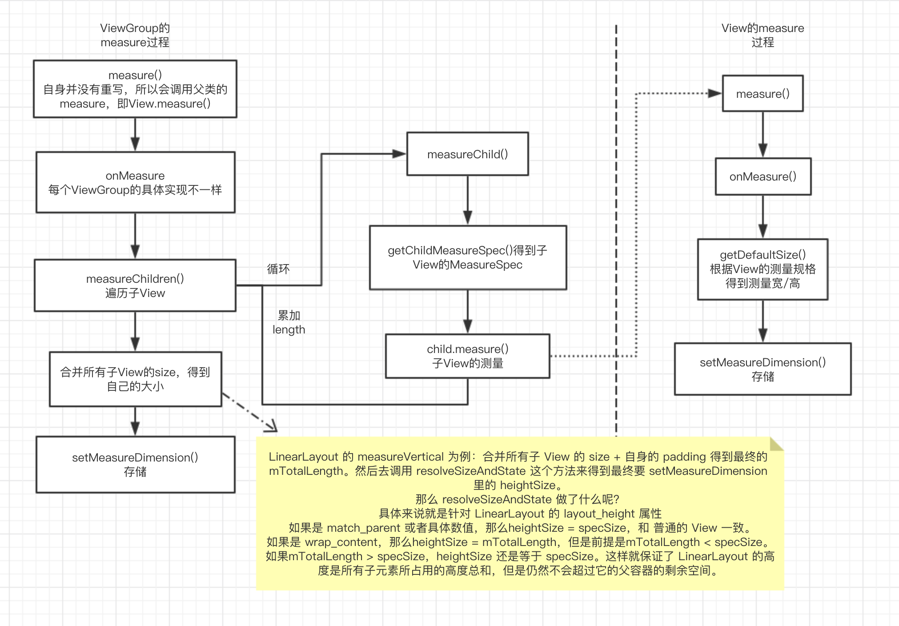

## View 绘制流程

如需详细了解，请看 [参考] 链接。

### 1. measure
measure 用于测量 view 的宽 / 高

MeasureSpec

|模式 | 具体描述 | 应用场景 | 备注 | 思考 |
| -- | -----   | ------ | -- |   ---: |
| UNSPECIFIED |
| EXACTLY | 子视图代下必须在父视图指定的确切尺寸内 | match_parent 或 具体数值(如100dp) | 当为具体数值时，View的最终大小就是Spec指定的值，所以父控件可通过 MeasureSpec.getSize()直接得到子控件的尺寸 | |
|AT_MOST | 父视图为子视图指定一个最大尺寸，子视图必须确保自身和它是所有子视图可适应在该尺寸内 | 自适应大小(wrap_content) | 该模式下，父控件无法确定子View的尺寸，只能由子控件自身根据需求计算尺寸。该模式= 自定义视图需要实现测量逻辑的情况 | 也就是说该模式下，自定义View需要自行实现onMeasure方法，确保测量准确？是的，给出默认大小 |

**注：图可能会不准确，因为是根据自己的思维走的流程，所以会省略很多已知东西。**




#### 1.1 问题1
分析完后，知道了 MeasureSpec 的作用，以及 ViewGroup 中的 getChildMeasureSpec 方法。在分析这个方法的时候，知道了如果子 View 没有给出具体的 dp 大小，那么测量出的大小会等于父容器当前剩余空间的大小。
即 `int size = Math.max(0, specSize - padding);`
在看的时候没有任何问题，但是自己想着想着的时候，突然被绕进去了，想到一个问题
**Q1： 当父ViewGroup 为 match_parent，子 View 是 wrap_content 时，子 View 的大小应该是多少 ?**
**A1：** 
因为根据 getChildMeasureSpec 方法可以知道，这个时候子 View 的大小是等于 父容器剩余空间的大小的，可是当我们用 ImageView，TextView 等做例子时，会发现他们并不是填充整个父容器，而是有着**刚好适应内容的最小尺寸**的。这个我就晕了，为啥跟结论不对呢。这个疑惑一直困扰着我看源代码。 后面才发现，ImageView、TextView 他们是复写了 onMeasure 的，在里面针对 wrap_content 的情况，会给宽/高一个默认值，当然这个默认值是有特殊处理的，至于怎么处理，查看他们的源码即可。
到这里终于解决了这个疑惑，原来是通过指定一个默认大小 (宽 / 高) 解决的这个问题。
**总结： 直接继承 View 的自定义控件需要重写 onMeasure 方法并设置 wrap_content 时的自身默认大小，否则在布局中使用 wrap_content 就相当于使用 match_parent。**

**TextView onMeasure 部分源码**
```
			// Check against our minimum width
            // width 在上面还会做各种处理,为了找到最小的 width
            width = Math.max(width, getSuggestedMinimumWidth());

			//当widthMode 为 AT_MOST，即 wrap_content 时，给 width 设置默认大小
            if (widthMode == MeasureSpec.AT_MOST) {
                width = Math.min(widthSize, width);
            }
```

#### 1.2 问题2
我们现在知道在 measure 的时候，父 View 会传入自己的 MeasureSpec 给子 View，用于测量。
即 `public final void measure(int widthMeasureSpec, int heightMeasureSpec)`中的 widthMeasureSpec、heightMeasureSpec 参数。
**Q2：那么假设 LinearLayout布局，orientation 为 vertical 的 ViewGroup 测量时，他并不知道自己的heightMeasureSpec 的 SpecSize 是多大呀，那子 View 是怎样在 getChildMeasureSpec() 中得到 parentSize 的呢。
（翻译：LinearLayout 的高度还没测量完，下面这段的代码的heightMeasureSpec是怎么确定的。因为要先把子 View 的高度计算出来，并累加起来，才能确定LinearLayout 的高度。）**
**A1:** 根据源码弄清楚流程。
```
				// Determine how big this child would like to be. If this or
                // previous children have given a weight, then we allow it to
                // use all available space (and we will shrink things later
                // if needed).
                final int usedHeight = totalWeight == 0 ? mTotalLength : 0;
                measureChildBeforeLayout(child, i, widthMeasureSpec, 0,
                        heightMeasureSpec, usedHeight);
```
这段是 LinearLayout 中 measureVertical 方法里 对子 View 进行 for 循环的那段。 这里对每个子 View 进行 measure 测量，而 measureChildBeforeLayout 里的 heightMeasureSpec  参数就是问题的疑惑点。

在** Q2 **的中透露出来这么一个逻辑导致了这样一个问题的产生。那就是在测量时，我们都知道 measureSpec 测量规格是由 父View 传来的，而在第一印象中 LinearLayout 就是子 View 的父View，所以我就会想这里既然这里是对子 View 进行测量，那这个 heightMeasureSpec 肯定是 LinearLayout 的 heightMeasureSpec 嘛，可是在垂直布局的 LinearLayout 中，高度是还不确定的，因为子 View 还没测量完，所以这里产生了疑惑。
后面仔细看代码，发现自己绕进去了，原来这里的 heightMeasureSpec 是 LinearLayout 的父 View 的heightMeasureSpec。因此解除了心中的疑惑，


### 2. layout


**因为  onLayout 在 ViewGroup中是抽象方法，所以自定义 ViewGroup，必须重写该方法。下面的代码为 自定义ViewGroup 中的 onLayout 伪码实现，这是通常的做法，具体怎么实现取决你自己**
```
@Override
    protected void onLayout(boolean changed, int l, int t, int r, int b) {
        //1. 遍历子View：循环所有子View
        for (int i = 0; i < getChildCount(); i++) {
            View child = getChildAt(i);

            //2. 计算当前子View的四个位置值
              //2.1 位置的计算逻辑
                //需自己实现，也是自定义View的关键

            //2.2 对计算后的位置值进行赋值
            int mLeft = left;
            int mTop = top;
            int mRight = right;
            int mBottom = bottom;

            //3. 根据上述4个位置的计算值，设置View的4个顶点，调用子View的layout
            child.layout(mLeft, mTop, mRight, mBottom);
        }
    }
```


### 3. draw


**问题 ： onDraw 只有在 View 里生效，ViewGroup 重写了也无用。( View 的特殊方法 setWillNotDraw )**
学习了 draw 流程后立马尝试了下，却发现在 ViewGroup 中不生效，此时我的心是拨凉拨凉的，后面查阅资料发现是由于一个小细节。
`View.setWillNotDraw()`
这个方法在捣蛋。
- 这是 View 中的特殊方法，它的作用是：当一个 View 不需要进行绘制时，系统会进行相应优化。
- 设为 **false** 代表不启动该标志位，即 **需要进行绘制**；
- 设为 **true** 代表启动该标志位，即 **不需要进行绘制**。
- 在默认情况下：View 是设为 false， 而 ViewGroup 是设为 true 的，所以导致了ViewGroup 没生效。
- **应用场景**
 a. setWillNotDraw参数设置为true：当自定义View继承自 ViewGroup 、且本身并不具备任何绘制时，设置为 true 后，系统会进行相应的优化。
 b. setWillNotDraw参数设置为false：当自定义View继承自 ViewGroup 、且需要绘制内容时，那么设置为 false，来关闭 WILL_NOT_DRAW 这个标记位。


### 4. 在 Activity 中正确的获取某个 View 的 宽 / 高

- 4.1 **在 Activity 中的 onWindowFocusChanged 方法获取**

- 4.2  **View.post(Runnable)**

- 4.3 **ViewTreeObserver 获取**

上述三种方法的获取代码如下：

```
private CustomView customView;

    @Override
    protected void onCreate(Bundle savedInstanceState) {
        super.onCreate(savedInstanceState);
        setContentView(R.layout.activity_main);
        customView = findViewById(R.id.custom_view);
        //尝试在onCreate 中获取
        Log.d(TAG, "onCreate: ----------->"+customView.getMeasuredWidth());
        Log.d(TAG, "onCreate: getWidth----------->"+customView.getWidth());
        //4.2 post 方法
        customView.post(new Runnable() {
            @Override
            public void run() {
                Log.d(TAG, "post Runnable: ----------->"+customView.getMeasuredWidth());
            }
        });

        //4.3 ViewTreeObserver 方法
        ViewTreeObserver observer = customView.getViewTreeObserver();
        observer.addOnGlobalLayoutListener(new ViewTreeObserver.OnGlobalLayoutListener() {
            @Override
            public void onGlobalLayout() {
                Log.d(TAG, "ViewTreeObserver: ----------->"+customView.getMeasuredWidth());
            }
        });
    }

	//4。1 onWindowFocusChanged 方法
    @Override
    public void onWindowFocusChanged(boolean hasFocus) {
        super.onWindowFocusChanged(hasFocus);
        Log.d(TAG, "onWindowFocusChanged: ----------->"+customView.getMeasuredWidth());
    }
```

**运行结果如下**


#### 5. 参考
https://www.jianshu.com/p/146e5cec4863
https://blog.csdn.net/yanbober/article/details/46128379


