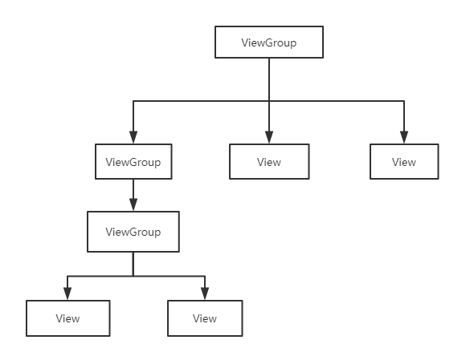
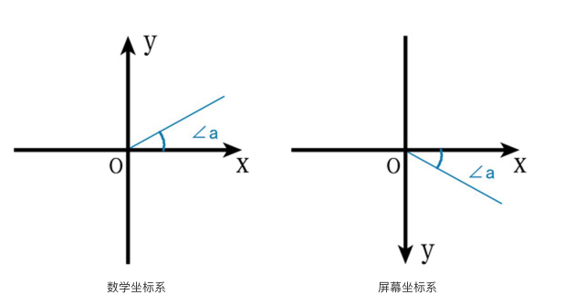
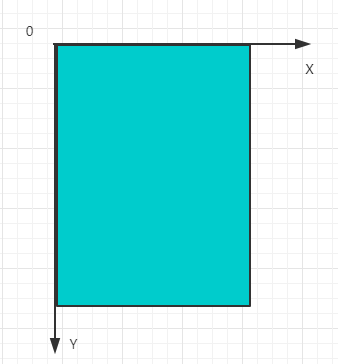
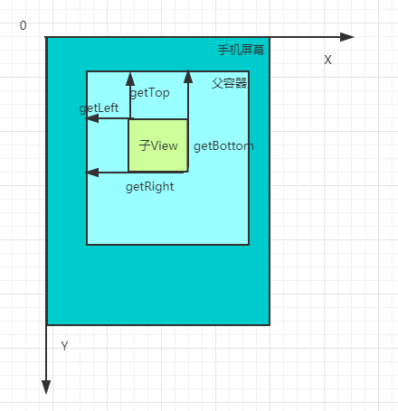
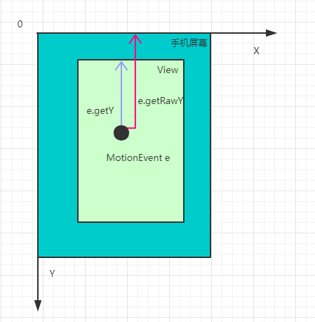

## View 绘制流程 —— 基础

### 1. View分类
| 类别 | 解释 | 特点 |
| ---- | ---- | ----: |
| 单一视图  | 即一个View，如 TextView                  |  不包含子View  |
| 视图组    | 即多个View组成的ViewGroup，如 LinearLayout | 包含子View   |
即视图View分为两类： **View**、**ViewGroup**

### 2. View类简介
- View 类是Android中各种组件的基类，如View是ViewGroup的基类
- View的构造方法 共有4个，具体如下 （自定义View必须重写至少一个构造方法）
```js
    public class CustomView extends View {
    	//如果View是在Java代码里new出来的，则调用第一个构造函数
    	public CustomView(Context context) {
    	    super(context);
    	}

    	//如果View是在 .xml 里声明的，则调用第二个构造函数
    	//自定义属性是从AttributeSet参数传进来的
    	public CustomView(Context context, @Nullable AttributeSet attrs) {
    	    super(context, attrs);
    	}
	
    	//不会自动调用
    	//一般是在第二个构造函数里主动调用的
    	//如View有style属性时
    	public CustomView(Context context, @Nullable AttributeSet attrs, int defStyleAttr) {
    	    super(context, attrs, defStyleAttr);
    	}
	
    	//API 21 之后才使用
    	//不会自动调用
    	//一般是在第二个构造函数里主动调用的
    	//如View有style属性时
    	public CustomView(Context context, @Nullable AttributeSet attrs, int defStyleAttr, int defStyleRes) {
        	super(context, attrs, defStyleAttr, defStyleRes);
    	}
    }
```


### 3. View视图结构
对于多 View 的视图，即视图组，结构是**树形结构**：最顶层是 ViewGroup，ViewGroup下可能有多个ViewGroup或View。


请记住：无论是 measure 过程、layout过程 还是 draw 过程，永远都是从 View 树的根节点开始测量或计算（即从树的顶端开始），一层一层，一个分支一个分支的进行。最终计算整个View树中各个View，最终确定整个View树的相关属性。

### 4. Android坐标系
- 区别于一般的数学坐标系


- Android实际屏幕上的默认坐标系如下:( 假设深色部分为手机屏幕)



### 5. View位置描述及获取
- View 的坐标系统是相对于父控件而言的。
```js
	getLeft();      //获取子View左上角距父View左侧的距离
	getTop();       //获取子View左上角距父View顶部的距离
	getRight();     //获取子View右下角距父View左侧的距离
	getBottom();    //获取子View右下角距父View顶部的距离
```


- 通过 MotionEvent 对象我们得到点击事件发送的 x 和 y 坐标
```js
	event.getX();
	event.getY();     //返回的是相对于当前View的坐标.

	event.getRawX();
	event.getRawY();  //返回的是相对于手机屏幕的坐标.
```




### 7. Android的角度 (angle) 与弧度 (radian)
- 自定义View实际是将一些简单的东西通过数学计算组合到一起形成的效果。
- 这其中可能会涉及到 画布的相关操作（旋转）,以及一些正选函数的计算等，这里面就涉及到角度与弧度的相关知识
- 数学公式: 假设  **rad 是弧度， deg 是角度**
$$ 2\pi（弧度） = 360（角度）* \pi / 180 $$

$$ deg = \cfrac{180}{\pi} \times rad  $$
同样的
$$ rad = deg \times \cfrac{\pi}{180} $$


### 8. Android的颜色
详情请查看 http://www.gcssloop.com/customview/Color


