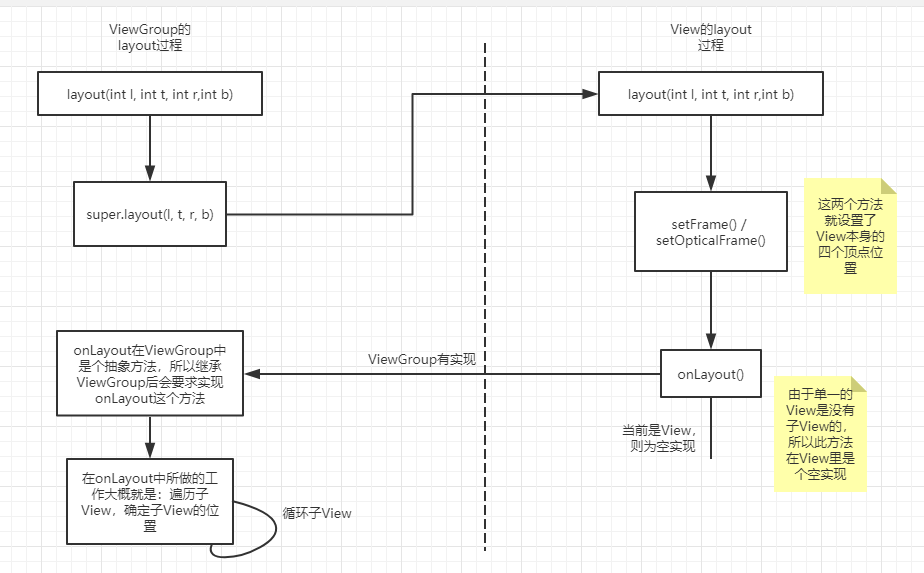

## View 绘制流程

### 1. measure
measure 用于测量 view 的宽 / 高

MeasureSpec

|模式 | 具体描述 | 应用场景 | 备注 | 思考 |
| -- | -----   | ------ | -- |   ---: |
| EXACTLY | 子视图代下必须在父视图指定的确切尺寸内 | match_parent 或 具体数值(如100dp) | 当为具体数值时，View的最终大小就是Spec指定的值，所以父控件可通过 MeasureSpec.getSize()直接得到子控件的尺寸 | |
|AT_MOST | 父视图为子视图指定一个最大尺寸，子视图必须确保自身和它是所有子视图可适应在该尺寸内 | 自适应大小(wrap_content) | 该模式下，父控件无法确定子View的尺寸，只能由子控件自身根据需求计算尺寸。该模式= 自定义视图需要实现测量逻辑的情况 | 也就是说该模式下，自定义View需要自行实现onMeasure方法，确保测量准确？ |


### 2. layout



**下面的代码为 ViewGroup 中的 onLayout 伪码实现**
```
@Override
    protected void onLayout(boolean changed, int l, int t, int r, int b) {
        //1. 遍历子View：循环所有子View
        for (int i = 0; i < getChildCount(); i++) {
            View child = getChildAt(i);

            //2. 计算当前子View的四个位置值
              //2.1 位置的计算逻辑
                //需自己实现，也是自定义View的关键

            //2.2 对计算后的位置值进行赋值
            int mLeft = left;
            int mTop = top;
            int mRight = right;
            int mBottom = bottom;

            //3. 根据上述4个位置的计算值，设置View的4个顶点，调用子View的layout
            child.layout(mLeft, mTop, mRight, mBottom);
        }
    }
```


### 3. draw


CustomView

```
//如果View是在Java代码里new出来的，则调用第一个构造函数
    public CustomView(Context context) {
        super(context);
    }

    //如果View是在 .xml 里声明的，则调用第二个构造函数
    //自定义属性是从AttributeSet参数传进来的
    public CustomView(Context context, @Nullable AttributeSet attrs) {
        super(context, attrs);
    }

    //不会自动调用
    //一般是在第二个构造函数里主动调用的
    //如View有style属性时
    public CustomView(Context context, @Nullable AttributeSet attrs, int defStyleAttr) {
        super(context, attrs, defStyleAttr);
    }

    @Override
    protected void onLayout(boolean changed, int l, int t, int r, int b) {
        //1. 遍历子View：循环所有子View
        for (int i = 0; i < getChildCount(); i++) {
            View child = getChildAt(i);

            //2. 计算当前子View的四个位置值
              //2.1 位置的计算逻辑
                //需自己实现，也是自定义View的关键

            //2.2 对计算后的位置值进行赋值
            /*int mLeft = left;
            int mTop = top;
            int mRight = right;
            int mBottom = bottom;*/

            //3. 根据上述4个位置的计算值，设置View的4个顶点，调用子View的layout
            //child.layout(mLeft, mTop, mRight, mBottom);
        }
    }

    @Override
    protected void onMeasure(int widthMeasureSpec, int heightMeasureSpec) {
        super.onMeasure(widthMeasureSpec, heightMeasureSpec);
        int widthMeasure = 0;
        int heightMeasure = 0;
        //1. 遍历子View
        measureChildren(widthMeasureSpec, heightMeasureSpec);

        //2. 合并子View 的尺寸大小

        //3. 存储
        setMeasuredDimension(widthMeasure, heightMeasure);
    }

    //API 21 之后才使用
    //不会自动调用
    //一般是在第二个构造函数里主动调用的
    //如View有style属性时
    /*public CustomView(Context context, @Nullable AttributeSet attrs, int defStyleAttr, int defStyleRes) {
        super(context, attrs, defStyleAttr, defStyleRes);
    }*/
```

